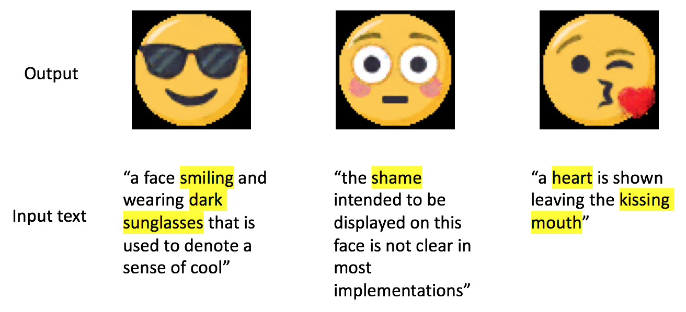
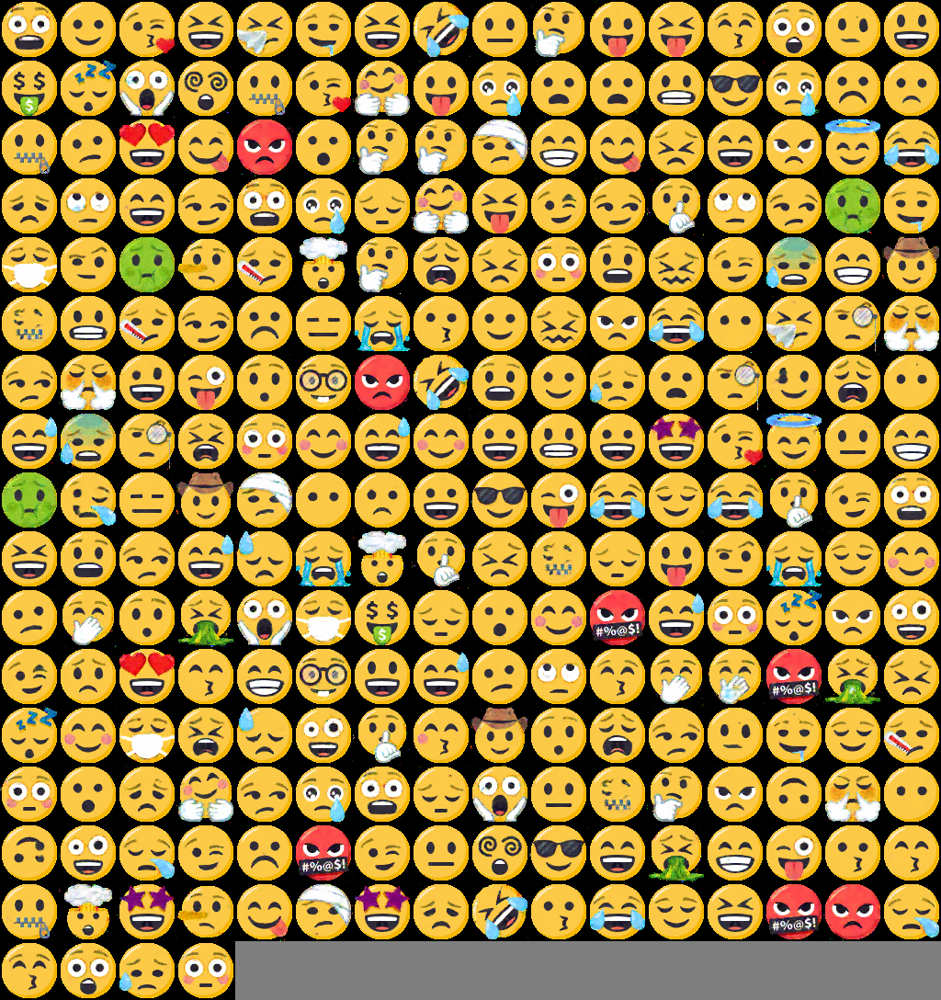

Generating Emoji with Conditional Deep Conditional Generative Adversarial Networks
===

This is the implementation of ["
Conditional Generative Adversarial Networks for Emoji Synthesis with Word Embedding Manipulation"](https://arxiv.org/abs/1712.04421) and ["EmotiGAN"](http://cs229.stanford.edu/proj2017/final-reports/5244346.pdf) written in Python 3.6.5 and Keras 2.1.5.  Because both papers don't publicly disclose their implementations and datasets, we implemented them and made the emoji caption dataset.

## Description
This model employs conditional deep generative adversarial networks and pre-trained GloVe embedding file, and is partially based on [KerasGAN](https://github.com/eriklindernoren/Keras-GAN) and [keras-text-to-image](https://github.com/chen0040/keras-text-to-image). Sample outputs are as follows:  



This implementation is easy to run, because we have prepared some cuseful scripts for preprocessing dataset. Please follow the following explanations and enjoy generating emoji!

## Requirement
You must install the following packages:  
* Keras
* NumPy
* TensorFlow
* Matplotlib
* OpenCV
* scikit-learn
* NLTK
* PIL
* Pandas
* SciPy

**NOTE**: we use TensorFlow as the Keras backend. Other than TensorFlow backend, we can't guarantee whether our implementation is runnable without any errors.

## Preprocessing
### Dataset
In order to organize dataset, please do the following procedures: 

1. Download emoji image dataset from [EmojiOne](https://www.emojione.com/)
2. Unzip and place them at `./emoji/original/`
3. Run the following commands:
    ```
    python preprocess_dataset.py "./emoji/original/EmojiOne_3.1.1_64x64_png"
    ```
    * If your EmojiOne file version is not 3.1.1, please change the second argument to the corresponding directory name.  

**NOTE**: In case you encounter a trouble, please check your file path and directories. We only use 64 x 64 [px] images.

### Word Embedding File
Our implemenatation requires the pre-trained word embedding file: [GloVe](https://nlp.stanford.edu/projects/glove/).
Please place the pre-trained GloVe file: "glove.6B.300d.txt" under `./utils/`.

## Usage  
**NOTE**: 
Please make sure that you have already downloaded image dataset and the GloVe file, and run the preprocessing python script, before running the following commands.

### Training  
To train the model, just run `python cgan_emoji.py 0`. After training, the weight file (.h5) and the history file (.csv) will be saved to `./saved_model/`. 

* Want to use GPUs?
    1. Open `cgan_emoji.py`
    2. Edit the following lines:
        ```
        # GPU setting
        import tensorflow as tf
        from keras.backend.tensorflow_backend import set_session
        config = tf.ConfigProto(
                    gpu_options = tf.GPUOptions(
                        visible_device_list="2", 
                        allow_growth=True)
                )
        set_session(tf.Session(config=config))
        ```
    3. Edit the visible device list: `visible_device_list`
    4. Run `python cgan_emoji.py 0`

### Generating Emoji  
To generate emoji by using the trained model, run `python cgan_emoji.py 1`.  

### Classifying Output Images  
You can evaluate the output images with our CNN-based classifier. Also, you can even train the classifier from the very beginning by designating "0" for `flag`. 

Run `python classifier.py flag classifier_weight_file.h5 generator_weight_file.h5 discriminator_weight_file.h5`

* Arguments  
    `flag`: This is **required**. You have to specifiy 0 (train a classifier), or 1 (classify output images).  
    `classifier_weight_file.h5`: This is **required** when `flag` is 1. Give your classifier weight file path.
    `generator_weight_file.h5`: This is **required** when `flag` is 1. Give your generator weight file path. 
    `discriminator_weight_file.h5`: This is **required** when `flag` is 1. Give your discriminator weight file path. 

**NOTE**: Because this project doesn't include the trained weight file for the classifier, please train the classifier itself first before evaluating the output images.

### Calculating Inception Score  
To calculate the inception score, you can use the following script.

Run `python inception_score.py generator_weight_file.h5 discriminator_weight_file.h5`

* Arguments  
    `generator_weight_file.h5`: This is **required** when `flag` is 1. Give your generator weight file path. 
    `discriminator_weight_file.h5`: This is **required** when `flag` is 1. Give your discriminator weight file path. 

## Example
### Preprocessing Dataset
Input
```
$ python preprocess_dataset.py "./emoji/original/EmojiOne_3.1.1_64x64_png/"
```

Output
```
Preprocessing emoji dataset...
Done!
```
* There should be 82 emoji images in `./emoji/edited/`.

### Training
Input  
```
$ python cgan_emoji.py 0
```
Output 
```
Using TensorFlow backend.
Acquiring images & labels...
Done!
>>> Dataset Size: 260
0-0 [D loss: 1.276546, acc.: 19.23%] [G loss: 0.915510] [Time: 6.406097]
0-1 [D loss: 1.179309, acc.: 51.92%] [G loss: 0.589891] [Time: 3.348730]
0-2 [D loss: 0.725383, acc.: 55.77%] [G loss: 1.024403] [Time: 3.455094]
0-3 [D loss: 0.846221, acc.: 51.92%] [G loss: 1.261873] [Time: 3.555842]
0-4 [D loss: 0.840152, acc.: 57.69%] [G loss: 1.529852] [Time: 3.614679]
0-5 [D loss: 0.862483, acc.: 57.69%] [G loss: 1.347816] [Time: 3.633967]
0-6 [D loss: 0.714281, acc.: 65.38%] [G loss: 1.421310] [Time: 3.670896]
0-7 [D loss: 0.716860, acc.: 59.62%] [G loss: 1.208927] [Time: 3.764489]
0-8 [D loss: 0.719423, acc.: 63.46%] [G loss: 1.251716] [Time: 3.685770]
0 (test) [D loss: 1.062994, acc.: 50.00%] [G loss: 1.893564] [Time: 1.519575]
```

* History files (learning progress and computation time per epoch) will be saved in `./saved_model/`. Also trained weight file will be saved in `./saved_model/`.

### Generating Emoji
Input
```
$ python cgan_emoji.py 1
```

Output
```  
Using TensorFlow backend.
Acquiring images & labels...
Done!
>>> Dataset Size: 260
Loading model...
Generating images...
Done!
```



* Output images will be saved in `./images/output/`, and their corresponding original images will be saved in `./images/original/`.

### Classifying Output Images

#### Training the Classifier
Input
```
$ python classifier.py 0
```

Output
```
Acquiring images & labels...
>>> Dataset Size: 260
>>> Dataset Size: 260
[0. 0. 0. 0. 0. 0. 0. 0. 0. 0. 0. 0. 0. 0. 0. 0. 0. 0. 0. 0. 0. 0. 0. 0.
 0. 0. 0. 0. 0. 0. 0. 0. 0. 0. 0. 0. 0. 0. 1. 0. 0. 0. 0. 0. 0. 0. 0. 0.
 0. 0. 0. 0. 0. 0. 0. 0. 0. 0. 0. 0. 0. 0. 0. 0. 0. 0. 0. 0. 0. 0. 0. 0.
 0. 0. 0. 0. 0. 0. 0. 0. 0. 0.]
Train on 234 samples, validate on 26 samples
Epoch 1/100
234/234 [==============================] - 10s 44ms/step - loss: 5.1930 - acc: 0.0385 - val_loss: 4.2741 - val_acc: 0.0769
~~~~~
~~~~~
Epoch 31/100
234/234 [==============================] - 10s 45ms/step - loss: 0.0894 - acc: 0.9744 - val_loss: 0.0020 - val_acc: 1.0000
Epoch 00031: early stopping
```

* The weight file for the classifier will be saved in `./saved_model/` as `classifier_weight.h5`; and the history file will be saved in `./saved_model/` as `history_classifier.csv`.

#### Classifying Output Images with the Trained Classifier
Input
```
$ python classifier.py 1 ./saved_model/classifier_weight.h5 ./saved_model/generator_weights.h5 ./saved_model/discriminator_weights.h5
```

Output
```
Using TensorFlow backend.
Acquiring images & labels...
Done!
>>> Dataset Size: 260
Loading model...
Generating images...
>>> Dataset Size: 260
>>> Dataset Size: 260
260/260 [==============================] - 3s 11ms/step
Accuracy: 0.8730769038200379
```

* The history file will be saved in `./saved_model/` as `acc_gan.csv`. Also, all generated images and its corresponding caption list will be placed at `./images/output/`.

### Calculating Inception Score
Input
```
$ python inception_score.py ./saved_model/generator_weights.h5 ./saved_model/discriminator_weights.h5
```

Output
```
Using TensorFlow backend.
Acquiring images & labels...
Done!
>>> Dataset Size: 260
Complete data loading!
Loading model...
Generating images...
Dataset score: 1.376090407371521, Generated score: 1.331783413887024
```

* The result scores will be saved in `./saved_model/` as `inception_gan.csv`.

## Licence

[MIT Licence](./LICENCE)
